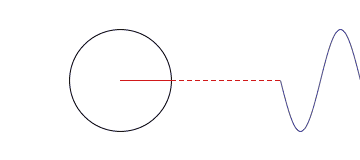

# JPEG学习 

## Compression Theory

### Image segmentation

分割成8x8的小块

### Convert color space

> 从RGBA色彩空间转换到YCbCr(还有些别的如: CMYK, GRAYSCALE, YCCK)

*L: 亮度 Cb: 蓝色色差 Cr: 红色色差*

1. 人眼对亮度更敏感
2. 通过LCbCr来区分重要的颜色信息与不重要的颜色信息
3. RGB => LCbCr可以有损也可以无损，取决于LCbCr的采样率(4:4:4, 4:2:2, 4:2:1)
4. 这里通常使用有损采样，会有第一部分压缩

### Discrete cosine transform

> 离散余弦变换

*理论依据：任何函数曲线都可以由多个余弦函数无限逼近*




通过这个函数找出高频点，尽量缩减高频且无用点的空间


### Quantization

> 量化Y Cb Cr三张表


其中G是我们需要处理的图像矩阵，Q称作量化系数矩阵（Quantization matrices），JPEG算法提供了两张标准的量化系数矩阵，分别用于处理亮度数据Y和色差数据Cr以及Cb。


量化处理后


### Zigzag

> 为了让上一步中右下角的多个0可以被进一步优化


### Run Length Coding

> 行程编码，一种无损编码。按照每组数字头4bit表示0的个数

```
// 例如
// before
-26, -3, 0, -3, -3, -6, 0, 0, 1, 0, 0, 0, 0, 0, 0
// after
(0, -26) (0, -3) (1, -3) (0, -3) (0, -6) (2, 1) EOB
```

### Huffman Coding

> 范式霍夫曼编码

```
// 下面摘取一段DHT(Define Huffman Table)
ffc4 0032 
10
  00 0104 0103 0302 0305 0900 0000 0000
0002 0103 0405 0607 1112 0013 2108 1409
2227 1516 1932 5631 3741 5157 9597 d5d7
```

* `FFC4`是DHT的MARKER，后面会介绍
* 后面`0032`是DHT长度(包含长度这两字节)，这里为**3*16+2=50**
* `10`的高8位的1/0嗯别代表AC/DC(交流/直流)。第八位`0`代表DHT的编号
* 后面跟着16字节的每一个字节表示对应的二进制长度。加在一起就是整体后面跟这数据的长度。
  **1+4+1+3+3+2+3+5+9=31**，这里也能回算出整个长度是*2+1+16+31=50**
* 下面根据上面信息可以整理出一个表格

|Code Length Data|Code Length|Data|
|----------------|-----------|----|
|0x00|1||
|0x01|2|0x02|
|0x04|3|0x01 0x03 0x04 0x05|
|0x01|4|0x06|
|0x03|5|0x07 0x11 0x12|
|0x03|6|0x00 0x13 0x21|
|0x02|7|0x08 0x14|
|0x03|8|0x09 0x22 0x27|
|0x05|9|0x15 0x16 0x19 0x32 0x56|
|0x09|10|0x31 0x37 0x41 0x51 0x57 0x95 0x97 0xd5 0xd7|
|0x00|11||
|0x00|12||
|0x00|13||
|0x00|14||
|0x00|15||
|0x00|16||

* 上面表格代表含义：0x02编码后的Code有2位，0x01 0x03 0x04 0x05编码后的Code有3位

#### Rule1
> 最小编码长度的第一个编码必须从 0 开始

#### Rule2
> 相同长度编码必须是连续的

#### Rule3
> 编码长度为j的第一个符号可以从编码长度为j-1的最后一个符号所得知，即
> `Cj = 2*((Cj-1) + 1)`

对应上表：
|编码前数据|编码后二进制数据|
|----------|----------------|
|0x02|00|
|0x01|010 编码长度与上一个不等,于是2*(00+1)=010|
|0x03|011 编码长度与上一个都是3,于是连续 010+1=011|
|0x04|100|
|0x05|101|
|0x06|1100 2*(101+1)=1100|
|0x07|11010 2*(1100+1)=11010|
|0x11|11011|
|0x12|11100|


## MARKERS
> JPEG有多个MARKER。用于标记不同信息。下面整理了规范中的MARKERS

|Code Assignment|Symbol|Description|
|---------------|------|-----------|
|ffc0|SOF<sub>0</sub>|First of frame. Baseline DCT|
|ffc4|DHT|Define Huffman table|
|ffcc|DAC|Define arithmetic coding conditioning|
|ffd0~ffd7|RST<sub>m</sub>|Restart with modulo 8 count “m”|

### Other Markers

|Code Assignment|Symbol|Description|
|---------------|------|-----------|
|ffd8|SOI|Start of image|
|ffd9|EOI|End of image|
|ffda|SOS|Start of scan|
|ffdb|DQT|Define quantization table|
|ffdc|DNL|Define number of lines|
|ffdd|DRI|Define restart interval|
|ffde|DHP|Define hierarchical progression|
|ffdf|EXP|Expand reference components|
|ffe0~ffef|APP<sub>n</sub>|Reserved for application segments|
|fff0~fffd|JPG<sub>n</sub>|Reserved for jpeg extensions|
|fffe|COM|Comment|

### Reserved Markers

|Code Assignment|Symbol|Description|
|---------------|------|-----------|
|ff01|TEM|For temporary private use in arithmetic coding|
|ff02~ffbf|RES|Reserved|

## Standard

`MARKER`后面有固定的2-byte的长度标记位用于标识该`MARKER`。不同的`MARKER`有更详细
的信息，这里不展开描述。

## References

- https://www.w3.org/Graphics/JPEG/itu-t81.pdf
- https://zh.wikipedia.org/wiki/%E8%89%B2%E5%BD%A9%E6%B7%B1%E5%BA%A6
- https://zh.wikipedia.org/wiki/EXIF
- http://www.cipa.jp/std/documents/e/DC-008-2012_E.pdf
- https://www.ibm.com/developerworks/cn/linux/l-cn-jpeg/index.html
