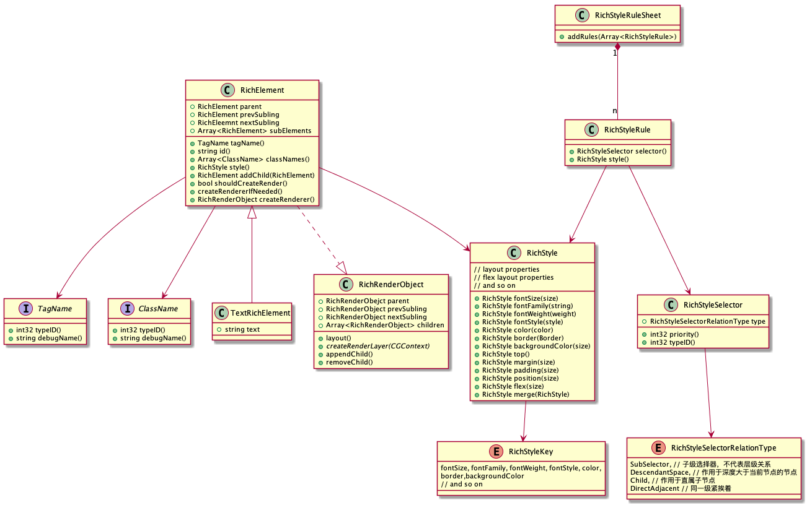
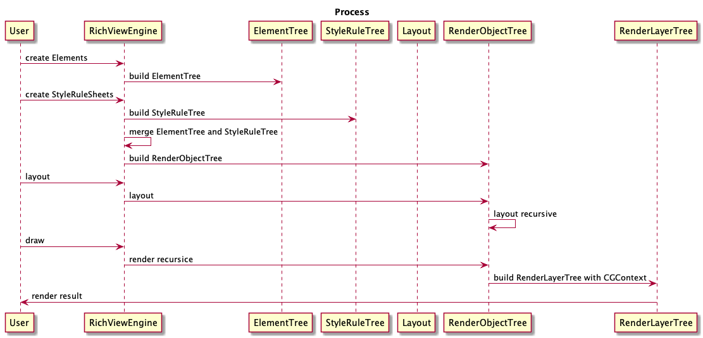

# LKLabel->LKRichView
## 背景
### 目前需要改进的点
- 不支持多层嵌套样式的处理
- 自身大小计算比较若，过度依赖preferMaxLayoutWidth
- 自定义NSAttributedKey较多，且没有较好的扩展原生枚举的方式。对使用者很不友好
- 容易让人与UILabel的一些行为产生关联，实际上UILabel根本无法满足真正的富文本场景
- 当前的很多实现依赖CTRunDelegate替换展位符的方式。这种方式导致我们用了一套较复杂的反算字符串偏移的机制，对他人维护不友好，对更复杂的扩展也不友好
- 目前不支持图文环绕排列。不过基于现有机制支持起来其实不麻烦，只是还没做
未来需要面对的挑战
- 业务能力方面
  - 接入Docs的展示能力
    - Markdown的标准支持，各种嵌套样式
    - 诸多不在MarkDown规范中的支持AT，docs文档等
    - CodeBlock的渲染
  - 针对上述场景的多选复制能力，类似较特殊的需求：其中AT这类需要当一个整体处理，不能单独粘贴
  - 支持hyphen（连字符，CoreText默认不支持，其他开源组件也很少支持）
- 性能方面
  - 超长文本在被折叠时，减少不必要的layout和render
  - 重新渲染时必要的缓存和局部更新（目前链接的渲染会重新全局绘制，这对Docs这种大段文本不友好）
## 技术术语
CoreText: https://developer.apple.com/documentation/coretext

## 已有方案调研
### YYText（目前实现最好的）
#### 优点：
1. 对原生NSAttributedString的扩展和封装
2. 可实现我们现阶段除了CodeBlock和AT外的其他全部需求（AT因为有一个选中状态不能跨过中间的特殊case，目前没想到不修改源码的实现方式）
3. 代码质量高
#### 缺点：
1. YYLabel不支持拖拽选中，我们的场景只能用YYTextView当Label来用
2. 没有局部更新，要实现链接的高亮状态需要重新设置属性字符串，重新layout重新render。在详情页中遇到超长Docs会有瓶颈
3. 布局扩展性局限：只有CoreText那套LineHeight、LineBreak、LineSpacing等布局方式
4. 最近一次提交是2yeas ago。。。而且目前还有很多已知bug。400多issues几乎只增不减
5. OC的代码
#### 结论：
1. 按照我们对富文本的产品期望。要用也要fork下来用
2. 本着追求极致的态度，没有最好的只有最合适的，还是需要自行增强（实现）一个更适合Lark的富文本引擎
### 其他的或质量堪忧或很不适合我们
DTCoreText（这个比较不错，实际测试性能还有提升的空间，普通图文混排列表滚动fps50左右，支持连字符）
ZSSRichTextEditor 
AttributedTextView 
MarkdownView 

## 概念
### RichElement
1. 脱离原生属性字符串，引入RichElement。每一段RichElement内部可以无限嵌套其他RichElement，RichElement通过设置text、RichStyle等属性来达到富文本定义
2. TextRichElement、ViewRichElement、CanvasRichElement
3. 本质上一个TextRichElement就是一个CTFrame
RichStyle
1. 提供统一的枚举对象RichStyle来统一用户使用，用户可以通过联想获得全部的属性支持
2. 屏蔽使用NSAttributedKey，同一个key的两种生效写法：kCTBackgroundColor vs NSAttributedKey.backgroundColor
如：
```swift
let style = RichStyle()
    .fontSize(10).fontFamily("PingFang")
    .color(.black).backgroundColor(.red)
    .border([.border(1, .blue, .solid])
```
### RichStyleRule、RichStyleRuleSheet
1. 引入RichStyleRule。使用者可以预设样式，做到真正只关心数据，而不用类似H1与H2多少间距，H2与H3中间多少间距这种复杂的UI概念。如：
```swift
enum TagName: RichStyleTag {
    case h1, h2, h3
}
let h1StyleRule = RichStyleRule(.h1).fontSize(16)
let h2StyleRule = RichStyleRule(.h2).fontSize(14)
let h3StyleRule = RichStyleRule(.h3).fontSize(12)
let styleSheet = RichStyleSheet([h1StyleRule, h2StyleRule, h3StyleRule])
    .addRef(.h1, .h2).marginTop(2).addRef(.h2, .h3).marginTop(1)
```
2. 引入RichStyleRuleSheet，是作用到富文本引擎的样式表。一个富文本引擎可以有多套样式表。样式重复时遵循后入者生效的原则
3. Element上的内敛Style优先级高于RichStyleRule中的Style
### InlineRichElement、BlockRichElement、InlineBlockRichElement
1. BlockRichElement规则：
  1. 默认占一行
  2. 可以设置大小
  3. 自由大小时由内部元素撑开
2. InlineRichElement规则
  1. 按照文字方式顺序排列，涉及断句、换行等
  2. 不可以设置大小
  3. 大小时由内部InlineRichElement和InlineBlockRichElement撑开
3. InlineBlockRichElement规则：
  1. 按照文字方式顺序排列，涉及断句、换行等
  2. 可以设置大小
  3. 自由大小时由内部元素撑开
### Float
1. 通过Float支持文字环绕
InlineFlexRichElement、FlexRichElement（可选）
1. 为了布局扩展性，引入Flex布局，作用于子孙Element之间
### RichLayout
1. 独立Layout，方便测试、异步布局
### RenderObjectModel
1. 描述可用于绘制的全部信息
2. 作为布局RichLayout的输入，同时作为RichLayout的输出，会被赋予布局后的位置、大小信息
3. 作为Render的输入，可以通过CGContext绘制自己所属的
### ElementTree、StyleRuleTree、RenderTree
1. ElementTree通过Elements构建
2. 如果引入RichStyleRuleSheet，则产生StyleRuleTree
3. 合并ElementTree和StyleRuleTree，产生RenderTree
## 设计
### UML

### 处理流程

### Debug
## 测试


