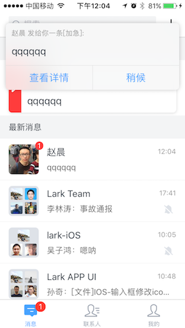

# Ding Alert 重构总结

## 前言

这是一个非常简单的模块，但我们做了大量的重构，其中很多问题都非常典型，我们认为重构后的质量比重构前的质量有质的提升。强烈建议仔细看这个总结，同时建议仔细阅读和对比重构前后的代码，我相信投入时间做这些工作非常值得: 如果能够理解和体会重构中的想法，并能在之后的工作中遵从，从这个重构中刻意练习所获得的提升会超过至少两年的工作实战

## 模块功能说明
这个模块的功能是收到加急消息时显示弹窗(见下图)

包含以下逻辑:

 1. 收到Ding时，进行弹窗
 1. 当有弹窗时再收到Ding，新弹一个窗，原弹窗在新弹窗后面，并上移错开一点
 1. 总共显示的弹窗不超过3个
 1. 将有3个弹窗后再来一个Ding，则用最后一个弹窗显示这个Ding，并显示到最上面。当这个弹窗被dismiss时，之前被挤出去的Ding将再次被显示(显示在最后)



这次重构涉及以下方面:

1. 接口设计: 定义模块，子模块，及其接口
2. 模块内部实现
3. 多处编码细节

下面分开说明

## 1.接口设计

接口要清晰简洁, 模块外部依赖尽量少(自包含)。

做到接口清晰简洁的方法有以下一些:

1. 合理划分模块，明确每个模块的职责
2. 斟酌接口，区分public和private
3. 斟酌命名(非常重要)

下面通过这次重构的一些改动进行具体说明。


### 1.1 去除对Message相关的依赖，实现模块自包含

通过如下改动实现模块自包含:

1. 定义Ding接口, Ding相关模块仅依赖Ding这个数据结构
2. DingAlert的addDing接口接受DingAlertViewDelegate参数, 让应用可以传入Alert的响应逻辑


### 1.2 删除DingAlertController.swift, 新增AlertViewCollection.swift

#### 重构内容
AlertViewCollection模块的接口如下，负责实现多个弹窗的逻辑:

```swift
class AlertViewCollection {
	init(maxViewNumber: Int, watcher: (() -> Void)?)
	func addDing(ding: Ding, delegate: DingAlertViewDelegate)
	func removeDing(dingId: DingId)
}
```

DingAlertController模块的接口如下，它既负责弹窗逻辑，又负责和iOS系统交互(ViewController)

```swift
class DingAlertController: BaseUIViewController, DingAlertViewDelegate {
	override func viewDidLoad()
	func addNewDing(message: LK_MessageModel)
	func resortAlerts()
	func removeDing(messageId: String)
	func showDing(_ ding: DingAlertView, completion: ((Void) -> Void)? = nil)
	func dismissDing(_ ding: DingAlertView, completion: ((Void) -> Void)? = nil)
	func alertLeftButtonTaped(alert: DingAlertView)
	func alertRightButtonTaped(alert: DingAlertView)
}
```

#### 重构理由和方法

1. 从结果看，重构后职责单一了，接口简单了
2. 职责单一是因为去除了ViewController逻辑，实事上，弹窗逻辑本身是独立的，ViewController逻辑只是弹窗逻辑跑在iOS系统上时才需要。类似的解耦有很多，比如，计算逻辑和运行环境解耦: 计算逻辑通过独立函数实现，其运行环境可以是多线程环境，协程环境等
3. 区分公有和私有接口，使公有接口变得清晰简洁

[//]: # "以下内容没怎么改"

### 1.1 DingAlert.swift

重构前

```swift
class DingAlert: DingAlertControllerDelegate {
    init() {
    }
    private var window: UIWindow = {
    }()
    private var viewController: DingAlertController = DingAlertController()

    func dingPushReceived(message: LK_MessageModel) {
    }
    func dingConfirmPushReceived(messageId: String) {
    }
    func show() {
    }
    func hide() {
    }
    func alertsIsEmpty(alertController: DingAlertController) {
    }
}
```

重构后

```Swift
class DingAlert {

    private var window: UIWindow
    private var collection: AlertViewCollection
    init() {
    }
    func addDing(ding: Ding, delegate: DingAlertViewDelegate) {
    }
    func removeDing(dingId: DingId) {
    }
}
```

#### 结论:

为了使接口明确清晰移除了不必要的公有函数, 类的结构变得清晰.


### 1.2 函数名调整

> 调整前

```swift
func dingPushReceived(message: LK_MessageModel) {
}
```

> 调整后

```swift
func addDing(ding: Ding, delegate: DingAlertViewDelegate) {
}
```

#### 结论

表述的意图更明确,dingPushReceived和业务贴得更近一些,addDing则是在描述类的接口的职责


### 1.3 private隐藏不对外暴露接口

> 调整前采用left,right命名

```swift
func leftAction() {
        self.delegate?.alertLeftButtonTaped(alert: self)
}

func rightAction() {
        self.delegate?.alertRightButtonTaped(alert: self)
}
```

> 调整后贴近功能,private化

```swift

private func detailAction() {
        self.delegation?.detail(alertView:self, ding: self.ding)
}

private func laterAction() {
        self.delegation?.later(alertView:self, ding: self.ding)
}
```

#### 结论

这两个函数是查看详情和稍候两个button点击响应的两个事件函数, 外部不需要,private隐藏起来. 函数名字修改同1.2


### 1.4 自包含,使用自有数据类型(Ding)

> 调整前使用LK_MessageModel

```swift
func dingPushReceived(message: LK_MessageModel) {
}
```

> 调整后使用Ding

```swift
func addDing(ding: Ding, delegate: DingAlertViewDelegate) {
}
```

> Ding的声明

```swift
protocol Ding {
    var user: LK_UserModel { get }
    var message: String { get }
    var id: String { get }
}
```

#### 结论

使用Ding 一是解除了与LK_MessageModel的耦合, 二是字段很简洁,LK_MessageModel里面大部分字段是不用关心的.


### 1.5 自包含,delegate传入,外部处理业务逻辑

> 调整前

```swift
func dingPushReceived(message: LK_MessageModel) {
}
```

> 调整后,delegate传入

```swift
func addDing(ding: Ding, delegate: DingAlertViewDelegate) {
}
```

> 调整前,DingAlert在处理业务逻辑

```swift
func alertLeftButtonTaped(alert: DingAlertView) {
        ///查看详情
        let message = alert.message
        self.removeDing(messageId: alert.message.id)
        if let chatItem = LarkSingletonSet.shared.chatDispatchModule.getChatItem(by: message.chatId) {
            let controller = ChatViewController.controllerWithSpecifiedPosition(position: message.position, chatItem: chatItem)
            Utils.currentNavControllerInTabBarController()?.pushViewController(controller, animated: true)
        }
    }

    func alertRightButtonTaped(alert: DingAlertView) {
        self.removeDing(messageId: alert.message.id)
    }
```

> 调整后,交由外部去处理业务

```swift
func detail(alertView: DingAlertView, ding: Ding) {
            self.delegate?.detail(alertView: alertView, ding: ding)
}

func later(alertView: DingAlertView, ding: Ding) {
            self.delegate?.later(alertView: alertView, ding: ding)
}
```

#### 结论

业务逻辑交由外部是处理,降低耦合,但delegate传递链有点长感觉稍有弊端 .函数改名同1.2


### 1.6 减少类的变量(状态)

> 调整前为了维护alertView的显示需求维护了三个状态

```swift
var alerts = [DingAlertView]()
var unShownAlerts = [DingAlertView]()
var allAlerts: [DingAlertView]
```

> 调整后,只剩下一个

```swift
private var alertBuffer: Set<DingAlertView>
```

#### 结论

类变量(状态)的减少不仅使类的结构变得简洁, 使用更少的变量逻辑会被简化很多.


## 2.逻辑表达

顺畅的逻辑表达可以增强对代码的理解, 简化逻辑复杂度

### 2.1 减少缩进

> 调整前 self.ding 是optional类型, 需要解包操作

```swift
func detailAction() {
        if let ding = self.ding {
            self.delegate?.detail(ding: ding)
        }
}
```

> 调整后 self.ding 是非optional类型,

```swift
func detailAction() {
        self.delegate?.detail(ding: ding)
}
```

> 典型的if-return模式, 没有else

```swift
private func getAlert(ding: Ding, delegate: DingAlertViewDelegate) -> DingAlertView {
        if let alert = self.alertBuffer.popFirst() {
            alert.ding = ding
            alert.delegation = delegate
            return alert
        }

        let alerts = self.visableAlerts()
        if alerts.count < self.maxViewNumber {
            let alert = DingAlertView(ding: ding)
            alert.ding = ding
            alert.delegation = delegate
            return alert
        }
        //reuse
        let alert = alerts.first!
        buffer.append((alert.ding, alert.delegation!))
        alert.ding = ding
        alert.delegation = delegate
        return alert
    }
```

#### 结论

通过各种方式减少缩进, 比如定义非optional类型, 采用 if return 而不是 if else …..  减少缩进会简化逻辑表达


### 2.2 逻辑中减少变量

> 调整前,使用了大量的变量来维护逻辑, 包括类变量,临时变量

```swift
        if self.alerts.count < 3 && !self.unShownAlerts.isEmpty {
            self.unShownAlerts.append(contentsOf: self.alerts)
            self.alerts = self.unShownAlerts
            self.unShownAlerts = [DingAlertView]()
            self.resortAlerts()
            return
        }
        var shownAlerts = self.alerts
        var tmpUnshownAlerts = self.unShownAlerts
        if self.alerts.count > 3 {//最多放三个
            //分成显示和不显示的两组
            tmpUnshownAlerts.append(contentsOf: shownAlerts)
            let allAlert = tmpUnshownAlerts
            tmpUnshownAlerts = [DingAlertView]()
            shownAlerts = Array(allAlert.suffix(3))
            tmpUnshownAlerts = Array(allAlert.prefix(allAlert.count - 3))
            self.alerts = shownAlerts
            self.unShownAlerts = tmpUnshownAlerts
        }
```

> 调整后变量明显变少逻辑简化

```swift
        if let alert = self.alertBuffer.popFirst() {
            return alert
        }
        let alerts = self.visableAlerts()
        if alerts.count < self.maxViewNumber {
            let alert = DingAlertView(ding: ding)
            return alert
        }
        //reuse
        let alert = alerts.first!
        buffer.append((alert.ding, alert.delegation!))
        return alert
```

#### 结论

逻辑表述中较少的变量会带来较简单的逻辑


## 3.其他

### 3.1 论名字的重要性

合理的命名非常重要

> 调整前的函数名,表述不清要做的意图,很难对应到实际使用场景

```Swift
func alertLeftButtonTaped(alert: DingAlertView) {
}
func alertRightButtonTaped(alert: DingAlertView) {
}
```

> 调整后详情操作, 稍候操作语义明确

```Swift
private func detailAction() {
}
private func laterAction() {
}
```


> 调整前的变量名

```swift
let buttonLeft = UIButton(type: .system)
let buttonRight = UIButton(type: .system)
```

> 调整后的变量名

```swift
let buttonDetail = UIButton(type: .system)
let buttonLater = UIButton(type: .system)
```

#### 结论

好的名字事半功倍


### 3.2 优化性能

程序能轻便迅速的运行同样重要

> 重构前数据和AlertView绑定在一起, 有一个Ding就有一个AlertView,没有重用

```swift
var alerts = [DingAlertView]()
```

> 重构后数据和View分离,AlertView进行重用

```swift
private var buffer: [Ding] = []
private var alertBuffer: Set<DingAlertView> = []
```


