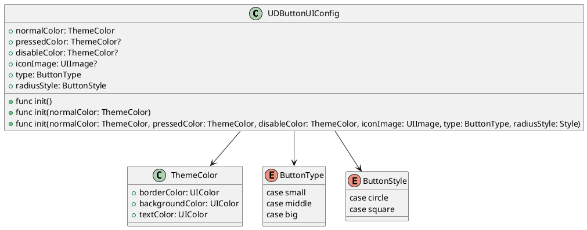

# UniverseDesignButton

## 组件作用

按钮用于执行用户在交互流程中触发指令、提交更改或完成的即时操作。

## 设计文档
### 需求

[Mobile 端 - 按钮 Button](https://bytedance.feishu.cn/docs/doccndGlxlBs1g4EOmNduYUaVbe#)

### 方案

根据[需求文档](#需求)，主要是针对 `button` 的属性进行抽取，并规定相关布局规范即可。通栏按钮、主要按钮、次要按钮、危险按钮、文字按钮及幽灵和全圆角按钮都是在此基础上配置对应 `UIConfig` 得到的 `button`。
文档中的悬浮按钮及图标按钮都是由对应图片`button`组成，无需抽象。

#### UDButtonUIConfig

`UDButtonUIConfig` 主要是针对需求中的 `button` 的UI属性的抽象。 `button` 的类型主要分为Default、Pressed、Disabled、Loading。其中Loading，由于属于处理点击事件的特殊状态，并不做处理。在Default、Pressed、Disabled三种状态下，`button` 主题颜色不同，其他ui属性不变。

`UDButtonUIConfig` 抽离了 `button` 以下UI属性：
- `CornerRadius`
- `Normal ThemeColor`
- `Pressed ThemeColor`
- `Icon`
- `Size Type`

##### ThemeColor
`UDButtonUIConfig` 的主题色由 `borderColor`、`backgroundColor`、`textColor`组成。

````swift
public struct ThemeColor {
    let borderColor: UIColor
    let backgroundColor: UIColor
    let textColor: UIColor

    public init(borderColor: UIColor,
                backgroundColor: UIColor,
                textColor: UIColor) {
                    self.borderColor = borderColor
                    self.backgroundColor = backgroundColor
                    self.textColor = textColor
    }
}
````

##### ButtonType

`ButtonType` 会限制 `button` 的最小宽度及最小高度，以及icon和文字的样式。非 `big` 类型的 `button` 在有icon和文字的情况下只能展示对应的icon。

````swift
public enum ButtonType {
    case small
    case middle
    case big
}
````

##### ButtonStyle

`ButtonStyle` 是 `button` 圆角对应的属性
- circle 对应 `CornerRadius` 为高度一半
- square 对应 `CornerRadius` 为2

````swift
public enum ButtonStyle {
    case circle
    case square
}
````

##### UIConfig



#### UDButton

`UDButton` 主要作为 `Universe Design Button`组件的基类，将对应的UI属性抽离。
`UDButton` 根据 [UDButtonUIConfig](#udbuttonuiconfig) 的属性设置对应的UI属性，在上文中不同属性的作用已经一一介绍，再次不在赘述。

##### API

`UDButton` 继承自 `UIButton`，对外主要提供了 `setUIConfig` 接口，方便调用方根据自身需求设置对应的UI样式。对外功能如下：
- 支持定制UI样式

````swift
class UDButton {

    `````

    public func setUIConfig(_ config: UDButtonUIConfig){
        ````
    }

    `````
}
````

##### extension

`UDThemeButton` 根据设计同学提供的样式进行扩展，方便调用放快速创建使用。

````swift
extension UDButton {
    public static var errorButton {
        let errorbutton = UDButton(config)
        return errorbutton
    }
}
````