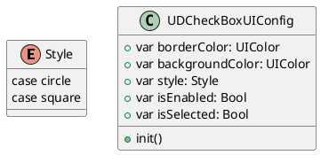
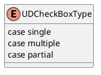

# CheckBox Development Document
> [Mobile端-单选框](https://bytedance.feishu.cn/docs/doccnySnm9ARJYG5ZQlk0U7LpY9#oW0j0v)
> [Mobile端-复选框](https://bytedance.feishu.cn/docs/doccnpanfsKZQ7jZpei2qlf1JFd#)

## 需求
根据设计师给出的文档总结有以下需求：
1. 提供单复现框
2. 支持border颜色、圆角等多种UI自定义
3. 点击反馈

## 设计方案
### UIConfig
根据需求，针对 `UDCheckBox` 的UI属性抽象，总结出以下几点
- 支持方形和圆形UI
- 支持Border颜色自定义
- 支持选中态背景色自定义
- 支持已选态
- 支持禁用态


### UDCheckBox
#### API
````
public init(boxType: UDCheckBoxType,
            config: UDCheckBoxUIConfig = UDCheckBoxUIConfig(),
            tapCallBack: ((UDCheckBox) -> Void)? = nil) { }

public func updateStatus(isSelected: Bool, isEnabled: Bool)
````

`UDCheckBox` 对外提供了`init` 及 `updateStatus`两个API
`init`：传入构建 `UDCheckBox` 的必要参数，并且UI相关属性不在可以修改。
`updateStatus`: 更新CheckBox选择及禁用状态。

使用方法：
````
let checkBox = UDCheckBox(boxType: .single)

checkBox.update(isSelected: false, isEnabled: true)
````

#### Type
根据设计稿，可以分为四类：
- 单选
- 复选
- 部分选择
- 列表选择

这里列表选择态，就是一个icon，所以并未算在此次设计中


#### UI设计
外部区域由自己绘制，中间icon大小为 12 * 12
布局：
````
private func commonInit(boxType: UDCheckBoxType = .single,
                        config: UDCheckBoxUIConfig = UDCheckBoxUIConfig()) {
    `````

    self.addSubview(wrapperView)
    self.wrapperView.addSubview(centerIconView)

    wrapperView.snp.makeConstraints { (make) in
        make.center.equalToSuperview()
        make.width.height.equalTo(20)
        make.edges.lessThanOrEqualToSuperview()
    }

    centerIconView.snp.makeConstraints { (make) in
        make.center.equalToSuperview()
        make.width.height.equalTo(12)
    }

    `````
}
````
由于Type及UI属性都是不可变的，在init时就已确定相应UI。`updateUI` 仅需根据 `isSelected` 以及 `isEnabled` 更新对应icon的显隐，及border和背景色即可。

````
private func updateUI() {
    centerIconView.isHidden = !self.isSelected

    if isEnabled {
        if isSelected {
            wrapperView.backgroundColor = config.backgroundColor
            wrapperView.layer.borderColor = UIColor.clear.cgColor
        } else {
            wrapperView.backgroundColor = UIColor.ud.N00
            wrapperView.layer.borderColor = config.borderColor.cgColor
        }
    } else {
        if isSelected {
            wrapperView.backgroundColor = UIColor.ud.N400
            wrapperView.layer.borderColor = UIColor.clear.cgColor
        } else {
            wrapperView.backgroundColor = UIColor.ud.N200
            wrapperView.layer.borderColor = UIColor.ud.N400.cgColor
        }
    }
}
````


## TODO
- [ ] Demo APP
- [ ] 使用文档