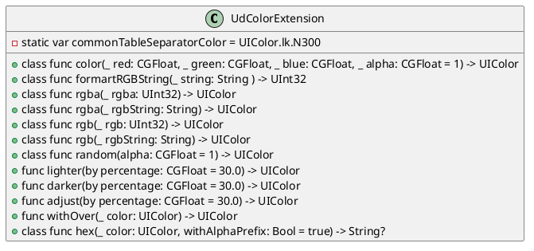
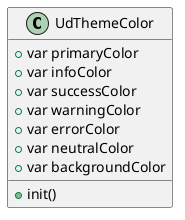

# Color Development Document
> 色彩系统是用于构建产品界面的色彩体系和使用规范，能够强化品牌风格，赋予产品活力、提供视觉识别延续性。可帮助用户区分信息层级，为操作提供视觉反馈和传达信息状态，是界面设计中基础元素。为保证视觉风格一致性，避免开发人员使用错乱带来不好体验，统一颜色组件是非常有必要的。
> [ESUX - 系统色彩规范](https://bytedance.feishu.cn/docs/doccnaAsH142wwUqifo3HvsAtZe)
> [ESUX - 主题定制化](https://bytedance.feishu.cn/docs/doccn1sB93r5rLzTcd4aiGepP18)

## 需求
根据设计师给出的[ESUX - 系统色彩规范](https://bytedance.feishu.cn/docs/doccnaAsH142wwUqifo3HvsAtZe)以及[ESUX - 主题定制化](https://bytedance.feishu.cn/docs/doccn1sB93r5rLzTcd4aiGepP18)，总结有以下需求：
1. 颜色语义化，如B50/B100等，对应不同RGB，外部统一使用语义化的颜色名称。
2. 需包含主题色相关语义化，如primary-color_1以及background-color等语义化颜色。

## 设计方案
### 颜色语义化
目前iOS已有相关颜色语义化组件[LarkColor](https://ee.byted.org/madeira/repo/ee/ios-infra/)，功能完善，已包括基础色板全部颜色，因此根据命名规范修改对应名称即可。
针对**UIColor**进行扩展，简便易用：
````
/// Ud: universe-ui design
public class UdColorExtension<BaseType> {
    var base: BaseType
    init(_ base: BaseType) {
        self.base = base
    }
}

public protocol UdColorExtensionCompatible {
    associatedtype UdColorCompatibleType
    var ud: UdColorCompatibleType { get }
    static var ud: UdColorCompatibleType.Type { get }
}

public extension UdColorExtensionCompatible {
    var ud: UdColorExtension<Self> {
        return UdColorExtension(self)
    }

    static var ud: UdColorExtension<Self>.Type {
        return UdColorExtension.self
    }
}

extension UIColor: UdColorExtensionCompatible {}
````
#### UdColor 功能
设计如下：

UdColorExtension 可根据调用方不同需求将RGBA等值生成对应颜色，并提供了部分语义化Color。
````
extension LarkColorExtension where BaseType == UIColor {
    /// 基础色板语义化
    public class var B50: UIColor { return rgb(0xF0F4FF) }
    ````
}
````
目前UdColor包含基础色板如下：
| 色板 | RGB |
| :-----: | :----: |
| B50 | 0xF0F4FF |
| B100 | 0xE1EAFF |
| B200 | 0xBACEFD |
| B300 | 0x82A7FC |
| B400 | 0x4E83FD |
| B500 | 0x3370FF |
| B500_1 | 0x1F6FFF|
| B600 | 0x245BDB |
| B700 | 0x1C4CBA |
| B800 | 0x133C9A |
| B900 | 0x0C296E |
| W50 | 0xECF9FE |
| W100 | 0xD9F3FD |
| W200 | 0xB1E8FC |
| W300 | 0x7EDAFB |
| W400 | 0x50CEFB |
| W500 | 0x14C0FF |
| W600 | 0x049FD7 |
| W700 | 0x037EAA |
| W800 | 0x006185 |
| W900 | 0x004761 |
| T50 | 0xEAFAF8 |
| T100 | 0xD5F6F2 |
| T200 | 0xA9EFE6 |
| T300 | 0x64E8D6 |
| T400 | 0x14E1C6 |
| T500 | 0x00D6B9 |
| T600 | 0x04B49C |
| T700 | 0x078372 |
| T800 | 0x036356 |
| T900 | 0x024B41 |
| Y50 | 0xFDF9ED |
| Y100 | 0xFAF1D1 |
| Y200 | 0xF8E6AB |
| Y300 | 0xF7DC82 |
| Y400 | 0xFAD355 |
| Y500 | 0xFFC60A |
| Y600 | 0xDC9B04 |
| Y700 | 0xAA7803 |
| Y800 | 0x795101 |
| Y900 | 0x5C3A00 |
| O50 | 0xFFF5EB |
| O100 | 0xFEEAD2 |
| O200 | 0xFED4A4 |
| O300 | 0xFFBA6B |
| O400 | 0xFFA53D |
| O500 | 0xFF8800 |
| O600 | 0xDE7802 |
| O700 | 0xB26206 |
| O800 | 0x8F4F04 |
| O900 | 0x6B3900 |
| R50 | 0xFEF1F1 |
| R100 | 0xFDE2E2 |
| R200 | 0xFBBFBC |
| R300 | 0xF98E8B |
| R400 | 0xF76964 |
| R500 | 0xF54A45 |
| R600 | 0xD83931 |
| R700 | 0xAC2F28 |
| R800 | 0x812520 |
| R900 | 0x621C18 |
| C50 | 0xFEF1F8 |
| C100 | 0xFDDDEF |
| C200 | 0xF9AED9 |
| C300 | 0xF57AC0 |
| C400 | 0xF14BA9 |
| C500 | 0xF01D94 |
| C600 | 0xC71077 |
| C700 | 0x9E1361 |
| C800 | 0x7A0F4B |
| C900 | 0x520A32 |
| P50 | 0xF6F1FE |
| P100 | 0xECE2FE |
| P200 | 0xCDB2FA |
| P300 | 0xAD82F7 |
| P400 | 0x935AF6 |
| P500 | 0x7F3BF5 |
| P600 | 0x6425D0 |
| P700 | 0x4E1BA7 |
| P800 | 0x380D82 |
| P900 | 0x270561 |
| N00 | 0xFFFFFF |
| N50 | 0xF8F9FA |
| N100 | 0xF5F6F7 |
| N200 | 0xEFF0F1 |
| N300 | 0xDEE0E3 |
| N400 | 0xBBBFC4 |
| N500 | 0x8F959E |
| N600 | 0x646A73 |
| N650 | 0x51565D |
| N700 | 0x373C43 |
| N800 | 0x2B2F36 |
| N900 | 0x1F2329 |
| N950 | 0x0F1114 |
| N1000 | 0x000000 |
| G50 | 0xF0FBEF |
| G100 | 0xD9F5D6 |
| G200 | 0xB7EDB1 |
| G300 | 0x8EE085 |
| G400 | 0x62D256 |
| G500 | 0x34C724 |
| G600 | 0x2EA121 |
| G700 | 0x237B19 |
| G800 | 0x186010 |
| G900 | 0x124B0C |
| L50 | 0xF7FAE5 |
| L100 | 0xEEF6C6 |
| L200 | 0xDFEE96 |
| L300 | 0xD2E76A |
| L400 | 0xC3DD40 |
| L500 | 0xB3D600 |
| L600 | 0x8FAC02 |
| L700 | 0x667901 |
| L800 | 0x495700 |
| L900 | 0x354200 |
| V50 | 0xFCEEFC |
| V100 | 0xF8DEF8 |
| V200 | 0xEFB9EF |
| V300 | 0xE58FE5 |
| V400 | 0xDB66DB |
| V500 | 0xD136D1 |
| V600 | 0xB320B3 |
| V700 | 0x8C218C |
| V800 | 0x681268 |
| V900 | 0x460B46 |
| I50 | 0xF2F3FD |
| I100 | 0xE0E2FA |
| I200 | 0xB4B9F3 |
| I300 | 0x7B83EA |
| I400 | 0x616AE5 |
| I500 | 0x4954E6 |
| I600 | 0x2933C7 |
| I700 | 0x161FA2 |
| I800 | 0x0A1285 |
| I900 | 0x0C1264 |

### 主题颜色
> 主题色列表：[ESUX - 主题定制化](https://bytedance.feishu.cn/docs/doccn1sB93r5rLzTcd4aiGepP18)

ThemeColor是组件主题必要组件之一。根据文档中所提到，主题色大致包含以下类型颜色
- primary-color /// 主要颜色
- info-color
- success-color
- warning-color
- error-color
- neutral-color
- background-color /// 背景色

ThemeColor设计如下：

ThemeColor提供多种init构造方法，以便外部调用可灵活使用，UdThemeColor为组件提供多场景颜色，以便组件使用时直接取到对应颜色。
````
extension UdThemeColor {
    /// 针对UdThemeColor 扩展颜色，将主题色语义化
    public var primaryColor1 = UIColor.ud.B50
    `````
}

/// 对UdColorExtension 时期获得主题色语义化的能力
/// 使用方法：let componentColor = UIColor.ud.theme.primaryColor1
extension UdColorExtension where BaseType == UIColor {
    publisc class var theme: UdThemeColor = UdThemeColor()
}
````

## TODO
- [ ] 迁移LarkColor
- [ ] ThemeColor能力扩展
- [ ] ReadMe文档